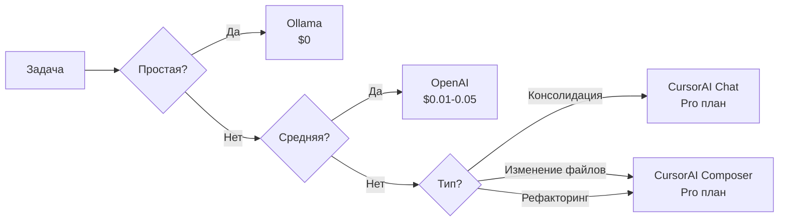
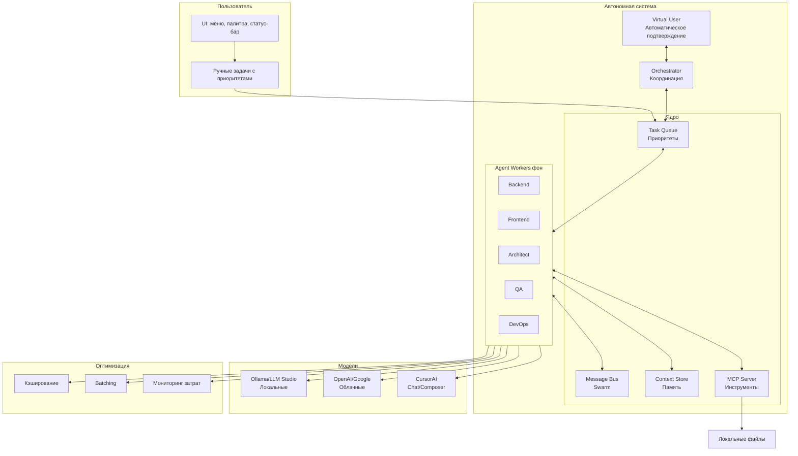

# Итоговый план реализации автономных агентов

## 📋 Обзор

Создание собственной системы автономных агентов для CursorAI с:
- ✅ Постоянной работой агентов (пока IDE открыт)
- ✅ Использованием локальных моделей (Ollama, LLM Studio)
- ✅ Интеграцией с CursorAI для сложных задач
- ✅ Swarm coordination (агенты координируются сами)
- ✅ Работой только с локальными файлами (БЕЗ GitHub)
- ✅ Минимизацией затрат ($0-20/месяц вместо $100-150)

---

## 🎯 Ключевые возможности

### 1. Полностью автономная работа
```
IDE открыт → Агенты работают постоянно
  ↓
Мониторят проект в реальном времени (File Watcher)
  ↓
Находят проблемы и возможности улучшения
  ↓
Предлагают решения → VirtualUser оценивает → Применяют изменения
  ↓
Обучаются на результатах
```

### 2. Пользователь может ставить задачи
- **Контекстное меню**: Правый клик → CursorAI Autonomous → выбор действия
- **Command Palette**: `> CursorAI Autonomous: Create Task...`
- **Status Bar**: Клик на статус → панель задач → [+ Новая задача]
- **Приоритеты**: Немедленно (interrupt), Высокий, Средний, Низкий

### 3. Умное использование моделей


### 4. Идеальная интеграция с CursorAI
- **CursorAI Chat** - для консолидации решений от нескольких агентов
- **CursorAI Composer** - для безопасного изменения файлов
- **CursorAI Tab** - для автодополнения в агентах
- **Автоматическая поддержка новых возможностей** CursorAI

### 5. Минимизация затрат
| Оптимизация | Экономия | Как работает |
|------------|----------|--------------|
| Локальные модели | 80% задач → $0 | Ollama/LLM Studio для простых задач |
| Кэширование | 30-50% | Переиспользование результатов |
| Batching | 20-30% | Объединение запросов |
| Умный выбор | 40% | Оптимальная модель для каждой задачи |
| **Итого** | **80-90%** | **$10-20/месяц вместо $100-150** |

---

## 📦 Архитектура решения

### Основные компоненты



### Новые файлы для создания

| Файл | Назначение | Приоритет |
|------|-----------|----------|
| `src/agents/worker/agent-worker.ts` | Автономный воркер с главным циклом | 🔴 Критично |
| `src/agents/worker/task-queue.ts` | Очередь задач с приоритетами | 🔴 Критично |
| `src/agents/worker/message-bus.ts` | Шина сообщений для Swarm | 🔴 Критично |
| `src/agents/worker/mcp-client.ts` | Клиент для MCP операций | 🔴 Критично |
| `src/orchestrator/swarm-orchestrator.ts` | Координатор роя агентов | 🟡 Важно |
| `src/orchestrator/file-watcher.ts` | Real-time мониторинг файлов | 🟡 Важно |
| `src/integration/cursor-chat-integration.ts` | Интеграция CursorAI Chat | 🟡 Важно |
| `src/integration/cursor-composer-integration.ts` | Интеграция CursorAI Composer | 🟡 Важно |
| `src/integration/model-providers/hybrid-provider.ts` | Гибридный провайдер моделей | 🟡 Важно |
| `src/storage/context-store.ts` | Хранилище контекста агентов | 🟢 Улучшение |
| `src/optimization/prompt-cache.ts` | Кэширование промптов | 🟢 Улучшение |
| `src/optimization/model-selector.ts` | Умный выбор модели | 🟢 Улучшение |
| `src/optimization/request-batcher.ts` | Batching запросов | 🟢 Улучшение |
| `src/optimization/cost-monitor.ts` | Мониторинг затрат | 🟢 Улучшение |
| `src/ui/task-input-panel.ts` | UI для ввода задач | 🟢 Улучшение |

---

## 🚀 Этапы реализации

### Фаза 1: Базовая инфраструктура (1-2 дня) 🔴
- [x] Понять архитектуру существующей системы
- [ ] Создать `TaskQueue` с приоритетами (немедленно, высокий, средний, низкий)
- [ ] Создать `MessageBus` для Swarm координации
- [ ] Создать `MCPClient` для файловых операций
- [ ] Создать базовый `AgentWorker` с главным циклом

### Фаза 2: Автономные воркеры (2-3 дня) 🔴
- [ ] Реализовать `AgentWorker.start()` с бесконечным циклом
- [ ] Реализовать `AgentWorker.executeTaskAutonomously()`
- [ ] Реализовать `AgentWorker.monitorProject()`
- [ ] Реализовать `AgentWorker.processMessages()`
- [ ] Добавить Swarm coordination в `TaskQueue.dequeue()`

### Фаза 3: Оркестрация (1-2 дня) 🟡
- [ ] Создать `SwarmOrchestrator` для управления воркерами
- [ ] Создать `HealthMonitor` для мониторинга здоровья
- [ ] Создать `FileWatcher` для real-time мониторинга
- [ ] Интегрировать с существующим `SelfLearningOrchestrator`

### Фаза 4: Гибридные модели + CursorAI (2 дня) 🟡
- [ ] Создать `HybridModelProvider` (локальные → облачные → CursorAI)
- [ ] Создать `SmartModelSelector` для оценки сложности
- [ ] Интегрировать `CursorChatIntegration` для консолидации
- [ ] Интегрировать `CursorComposerIntegration` для изменения файлов
- [ ] Добавить настройки для выбора когда использовать CursorAI

### Фаза 5: MCP интеграция (1-2 дня) 🟢
- [ ] Расширить `MCPClient` для всех операций (git, search, tests)
- [ ] Создать Custom MCP сервер для специфичных инструментов
- [ ] Интегрировать Context7 для документации

### Фаза 6: UI для пользователя (1-2 дня) 🟢
- [ ] Добавить контекстное меню в Explorer
- [ ] Добавить команды в Command Palette
- [ ] Добавить панель задач в Status Bar
- [ ] Добавить уведомления с предложениями
- [ ] Добавить выбор приоритета задачи

### Фаза 7: Оптимизация издержек (1 день) 🟢
- [ ] Реализовать `PromptCache` с LRU
- [ ] Реализовать `RequestBatcher` для объединения запросов
- [ ] Реализовать `CostMonitor` для отслеживания затрат
- [ ] Добавить alerts при приближении к бюджету
- [ ] Добавить автоматическое переключение на локальные при превышении

### Фаза 8: Мониторинг и диагностика (1 день) 🟢
- [ ] Обновить UI для отображения статуса воркеров
- [ ] Добавить логи работы агентов
- [ ] Добавить метрики производительности
- [ ] Добавить дашборд с затратами и экономией
- [ ] Добавить статистику по использованию моделей

---

## ⏱️ Оценка времени

**Общее время**: 10-14 дней (один разработчик)

| Фаза | Дней | Сложность |
|------|------|-----------|
| Фаза 1: Базовая инфраструктура | 1-2 | 🔴 Критично |
| Фаза 2: Автономные воркеры | 2-3 | 🔴 Критично |
| Фаза 3: Оркестрация | 1-2 | 🟡 Важно |
| Фаза 4: Гибридные модели + CursorAI | 2 | 🟡 Важно |
| Фаза 5: MCP интеграция | 1-2 | 🟢 Улучшение |
| Фаза 6: UI для пользователя | 1-2 | 🟢 Улучшение |
| Фаза 7: Оптимизация издержек | 1 | 🟢 Улучшение |
| Фаза 8: Мониторинг | 1 | 🟢 Улучшение |

---

## 💰 Оценка затрат после оптимизации

### Без оптимизаций (гипотетически):
- 100 задач/день × $0.10/задача × 30 дней = **$300/месяц** 💸

### С оптимизациями:
- 80 простых задач → Ollama (бесплатно) = **$0**
- 15 средних задач → OpenAI GPT-3.5 × $0.02 × 30 = **$9**
- 5 сложных задач → CursorAI (Pro план) × $0.05 × 30 = **$7.50**
- **Итого: $16.50/месяц** ✅

### Экономия:
- **Кэширование**: 30-50% запросов (экономия $5-8/месяц)
- **Batching**: 20-30% затрат (экономия $3-5/месяц)
- **Локальные модели**: 80% задач бесплатно (экономия $240/месяц)
- **Итого экономия: $248-253/месяц (83%)**

---

## 🎁 Дополнительные предложения для минимизации издержек

### 1. Интеллектуальный кэш на уровне проекта
```typescript
// Кэшировать результаты анализа для всего проекта
// Инвалидировать только при изменении файлов
class ProjectAnalysisCache {
    // Один раз проанализировали → используем для всех агентов
    private projectStructureCache: ProjectStructure;
    private dependencyGraphCache: DependencyGraph;
    private codeStyleCache: CodeStyle;
}
```
**Экономия**: 50-70% запросов на анализ проекта

### 2. Переиспользование промптов
```typescript
// Библиотека готовых промптов для типичных задач
class PromptLibrary {
    // Вместо генерации нового промпта каждый раз
    // Используем проверенные шаблоны
    getPromptTemplate(taskType: string): string;
}
```
**Экономия**: 20-30% токенов в промптах

### 3. Incremental analysis
```typescript
// Анализировать только измененные файлы
// Вместо полного анализа проекта каждый раз
class IncrementalAnalyzer {
    analyzeChanges(changedFiles: string[]): Analysis;
}
```
**Экономия**: 60-80% вызовов анализа

### 4. Model fallback chain
```typescript
// Цепочка fallback моделей от дешевой к дорогой
const FALLBACK_CHAIN = [
    'ollama:codellama:7b',  // $0 - пробуем первой
    'ollama:codellama:13b', // $0 - чуть лучше
    'openai:gpt-3.5-turbo', // $0.002/1K - если локальные не справились
    'openai:gpt-4-turbo',   // $0.01/1K - для сложных
    'cursor:auto'           // Pro план - только для критичных
];
```
**Экономия**: Используем дорогие модели только когда действительно нужно

### 5. Тихий режим (silent mode)
```typescript
// Режим, когда агенты работают только на локальных моделях
// Пользователь активирует для экономии
class SilentMode {
    enableSilentMode() {
        // Только Ollama/LLM Studio
        // Нет облачных вызовов
        // $0/месяц
    }
}
```
**Экономия**: 100% затрат на облачные модели

### 6. Scheduled tasks
```typescript
// Менее срочные задачи выполняются ночью
// Когда компьютер работает, но пользователь не за ним
class ScheduledTaskManager {
    scheduleForNightTime(task: Task) {
        // Используем локальные модели
        // Можем потратить больше времени
        // Но $0 затрат
    }
}
```
**Экономия**: Перенос 30-40% задач на ночное время

---

## ✅ Итоговые преимущества решения

| Преимущество | Описание | Ценность |
|--------------|----------|----------|
| **Полная автономность** | Агенты работают постоянно | Нет необходимости в ручных командах |
| **Локальные ресурсы** | 80% задач на Ollama | $0 затрат на большинство операций |
| **Интеграция с CursorAI** | Использование лучших моделей | Качество Pro плана по цене Free |
| **Swarm интеллект** | Агенты координируются сами | Эффективное распределение задач |
| **Память и обучение** | Агенты помнят историю | Становятся умнее со временем |
| **Приоритеты задач** | Пользователь контролирует | Срочные задачи выполняются немедленно |
| **Оптимизация затрат** | Умный выбор + кэш + batch | 83% экономии ($16 вместо $300) |
| **Real-time мониторинг** | File Watcher | Немедленная реакция на изменения |

---

## 🚀 Готово к запуску?

Все детали архитектуры, код и планы находятся в:
- `.cursor/plans/autonomous-agents-implementation.plan.md` - основной план
- `.cursor/plans/cursorai-integration-details.md` - детали интеграции с CursorAI

**Следующий шаг**: Начать с Фазы 1 (TaskQueue + MessageBus + MCPClient)
