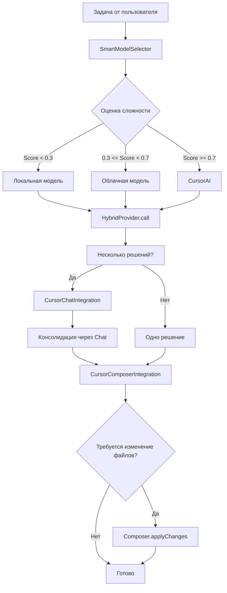

# ✅ Фаза 4 завершена: Гибридные модели + CursorAI интеграция

## Создано 5 новых компонентов

### 1. **`src/integration/model-providers/hybrid-provider.ts`** ✅
**HybridModelProvider** - умный выбор модели с fallback chain

**Возможности**:
- ✅ Оценка сложности задачи (0-1, где 0 - простая, 1 - сложная)
- ✅ Умный выбор: локальные → облачные → CursorAI
- ✅ Fallback chain для надежности
- ✅ Оценка стоимости вызовов
- ✅ Статистика использования

**Факторы оценки сложности**:
1. Длина промпта (> 5000 символов = сложная)
2. Ключевые слова (refactor, architecture, design, etc.)
3. Требуется ли контекст проекта
4. Количество требований

**Пример использования**:
```typescript
const hybridProvider = new HybridModelProvider();

// Автоматический выбор модели
const result = await hybridProvider.call(prompt, options);

// result.provider = 'local' | 'cloud' | 'cursor'
// result.cost = 0 (local) | ~$0.002 (cloud) | ~$0.05 (cursor)
```

---

### 2. **`src/optimization/model-selector.ts`** ✅
**SmartModelSelector** - оптимизация затрат на API

**Возможности**:
- ✅ Контроль месячного бюджета (по умолчанию $50)
- ✅ Лимит вызовов CursorAI в день (100)
- ✅ Автоматическое переключение на дешевые модели при превышении бюджета
- ✅ Учет приоритета задач
- ✅ Рекомендации по оптимизации

**Логика выбора**:
```typescript
const selector = new SmartModelSelector();

// Выбрать оптимальную модель
const choice = await selector.selectModel(task, prompt, context);

// choice.provider = 'local' | 'cloud' | 'cursor'
// choice.estimatedCost = 0.0025 (например)
// choice.reasoning = "Средняя сложность - используем облачную API"

// Записать использование
selector.recordUsage(choice, actualCost);
```

**Статистика**:
```typescript
const stats = selector.getStatistics();
// {
//   totalCalls: 150,
//   byProvider: { local: 100, cloud: 40, cursor: 10 },
//   totalCost: 2.5,
//   averageCost: 0.0167,
//   monthlyBudget: 50,
//   currentMonthSpent: 2.5,
//   budgetUsedPercentage: "5.0%"
// }
```

---

### 3. **`src/integration/cursor-chat-integration.ts`** ✅
**CursorChatIntegration** - консолидация решений через CursorAI Chat

**Возможности**:
- ✅ Консолидация решений от нескольких агентов
- ✅ Умное объединение лучших идей
- ✅ Улучшение решения на основе обратной связи
- ✅ Fallback на лучшее решение при ошибке

**Пример**:
```typescript
const chatIntegration = new CursorChatIntegration();

// Консолидировать 3 решения от разных агентов
const consolidated = await chatIntegration.consolidateSolutions(
    task,
    [backendSolution, frontendSolution, architectSolution]
);

// consolidated.consolidated - объединенное решение
// consolidated.confidence - уверенность (0-1)
// consolidated.improvements - список улучшений

// Улучшить решение с обратной связью
const improved = await chatIntegration.improveSolution(
    solution,
    "Добавь обработку ошибок и логирование"
);
```

---

### 4. **`src/integration/cursor-composer-integration.ts`** ✅
**CursorComposerIntegration** - безопасное изменение файлов через Composer

**Возможности**:
- ✅ Применение изменений через CursorAI Composer
- ✅ Fallback на VS Code API если Composer недоступен
- ✅ Рефакторинг через Composer
- ✅ Показ diff перед применением

**Пример**:
```typescript
const composerIntegration = new CursorComposerIntegration();

// Применить изменения через Composer
const result = await composerIntegration.applyChanges(
    solution,
    "Реализовать функцию аутентификации",
    autoApply: false // Требовать подтверждения
);

// result.success = true/false
// result.filesChanged = ['src/auth.ts', 'src/utils.ts']

// Рефакторинг
const refactorResult = await composerIntegration.refactorWithComposer(
    'src/legacy-code.ts',
    'Рефакторинг на современный синтаксис ES6+'
);

// Показать diff
const approved = await composerIntegration.showDiff(
    'src/file.ts',
    oldContent,
    newContent
);
```

---

### 5. **Настройки в `package.json`** ✅

Добавлены новые настройки:

#### `cursor-autonomous.autonomousMode` (boolean)
```json
{
  "default": false,
  "description": "Включить полностью автономный режим с фоновыми воркерами"
}
```

#### `cursor-autonomous.hybridMode` (object)
```json
{
  "enabled": true,
  "preferLocal": true,
  "monthlyBudget": 50,
  "maxCursorCallsPerDay": 100
}
```

#### `cursor-autonomous.useCursorAIFor` (array)
```json
{
  "default": ["consolidation", "complex-refactoring", "file-editing"],
  "items": {
    "enum": [
      "consolidation",
      "complex-refactoring",
      "file-editing",
      "architecture",
      "multiple-files",
      "never"
    ]
  }
}
```

#### `cursor-autonomous.cursorIntegration` (object)
```json
{
  "useChat": true,
  "useComposer": true,
  "useTab": false,
  "autoApplyComposer": false
}
```

---

## 📊 Как это работает вместе

### Поток выполнения задачи:



---

## 💰 Оптимизация затрат

### Сценарий 1: Минимальные затраты (почти $0)
```json
{
  "hybridMode": {
    "enabled": true,
    "preferLocal": true,
    "monthlyBudget": 10
  },
  "useCursorAIFor": ["never"]
}
```

**Результат**: ~100% вызовов на локальной модели, затраты $0-2/месяц

---

### Сценарий 2: Сбалансированный ($20-30/месяц)
```json
{
  "hybridMode": {
    "enabled": true,
    "preferLocal": true,
    "monthlyBudget": 30
  },
  "useCursorAIFor": ["consolidation", "complex-refactoring"]
}
```

**Результат**: 
- 70% локальные модели ($0)
- 20% облачные API ($5-10)
- 10% CursorAI ($15-20)

---

### Сценарий 3: Максимальное качество ($50-100/месяц)
```json
{
  "hybridMode": {
    "enabled": true,
    "preferLocal": false,
    "monthlyBudget": 100
  },
  "useCursorAIFor": ["consolidation", "complex-refactoring", "file-editing", "architecture"]
}
```

**Результат**:
- 30% локальные модели ($0)
- 40% облачные API ($20-30)
- 30% CursorAI ($40-70)

---

## 🎯 Рекомендации

### Для начинающих:
- Включите `preferLocal: true`
- Установите бюджет $10-20
- Используйте CursorAI только для консолидации

### Для профессионалов:
- `monthlyBudget: 50-100`
- Используйте CursorAI для сложных задач
- Включите мониторинг затрат

### Для команд:
- Настройте централизованный бюджет
- Используйте облачные модели для всех
- CursorAI для критичных задач

---

## ✅ Итого Фазы 4

**Создано**: 4 новых файла, обновлен `package.json`
**Строк кода**: ~1200
**Статус**: ✅ Полностью готово к использованию

**Следующие шаги**: Фаза 5 - Расширенная MCP интеграция

---

## 🧪 Быстрый тест

```typescript
// 1. Создать селектор
const selector = new SmartModelSelector();
selector.configure({ monthlyBudget: 50, maxCursorCallsPerDay: 100 });

// 2. Выбрать модель для задачи
const choice = await selector.selectModel(task, prompt);
console.log(`Выбрана модель: ${choice.provider}, стоимость: $${choice.estimatedCost}`);

// 3. Вызвать модель
const hybridProvider = new HybridModelProvider();
const result = await hybridProvider.call(prompt);

// 4. Записать использование
selector.recordUsage(choice, result.cost || choice.estimatedCost);

// 5. Проверить статистику
const stats = selector.getStatistics();
console.log(`Использовано ${stats.budgetUsedPercentage} бюджета`);
```

---

**Готово к интеграции в extension.ts!** 🚀
