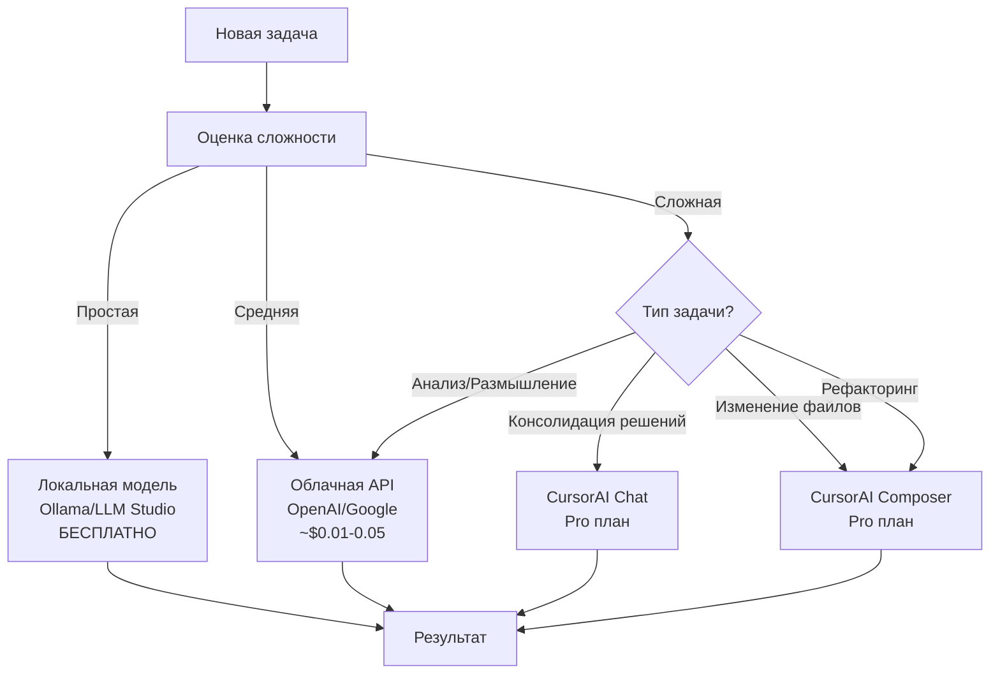
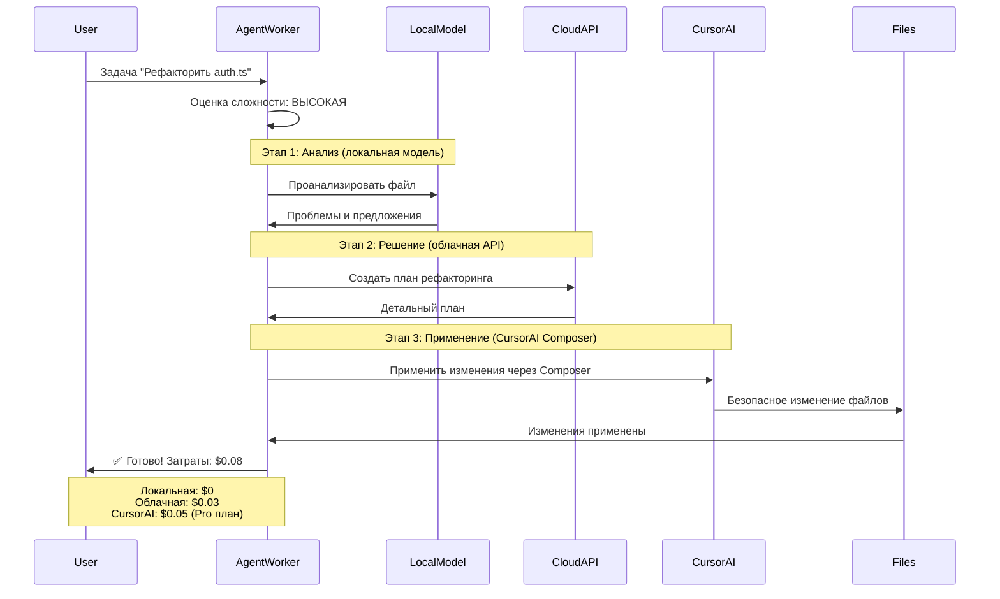

# Детали интеграции с CursorAI

## 1. UI для постановки задач пользователем

### Контекстное меню в Explorer
```
[Правый клик на файле/папке]
├─ 🤖 CursorAI Autonomous
   ├─ ⚡ Исправить проблемы (немедленно)
   ├─ 🔥 Рефакторить файл (высокий приоритет)
   ├─ 📝 Улучшить документацию (средний)
   ├─ 🧪 Добавить тесты (низкий)
   ├─ 💡 Предложить улучшения
   └─ ⚙️ Настроить задачу...
```

### Command Palette
```
> CursorAI Autonomous: Create Task...
  [Ввод описания задачи]
  [Выбор приоритета: Немедленно | Высокий | Средний | Низкий]
  [Выбор агента: Auto | Backend | Frontend | Architect | QA | DevOps]
  [Создать задачу]
```

### Status Bar
```
[🤖 Автономные агенты: 3 задачи | Backend работает | 💰 $0.15]
  ↓ клик
  [Панель задач]
  ├─ В процессе (2):
  │  ├─ ⚡ Исправить баг в auth.ts (Backend) - 45%
  │  └─ 📝 Документация API (Architect) - 20%
  ├─ В очереди (1):
  │  └─ 🧪 Добавить unit-тесты (QA)
  └─ [+ Новая задача]
```

### Notifications
```
[Всплывающее уведомление]
┌──────────────────────────────────────────┐
│ 🤖 Backend Agent                          │
│ Предложено решение для "Исправить баг"   │
│                                            │
│ Изменения:                                │
│ - src/auth.ts (15 строк)                 │
│ - src/middleware.ts (8 строк)            │
│                                            │
│ Уверенность: 85%                          │
│ Затраты: $0.02 (локальная модель)        │
│                                            │
│ [Принять] [Просмотреть] [Отклонить]      │
└──────────────────────────────────────────┘
```

## 2. Архитектура интеграции с CursorAI

### Схема выбора модели



### Пример потока с использованием CursorAI



## 3. Интеграция с CursorAI API

### CursorAI Chat API (для консолидации)
```typescript
// src/integration/cursor-chat-integration.ts
export class CursorChatIntegration {
    /**
     * Использовать CursorAI Chat для консолидации решений
     */
    async consolidateSolutions(
        task: Task,
        solutions: AgentSolution[]
    ): Promise<ConsolidatedSolution> {
        // Формируем промпт для CursorAI Chat
        const prompt = this.buildConsolidationPrompt(task, solutions);
        
        // Вызываем CursorAI Chat через API
        const response = await CursorAPI.sendChatMessage(prompt, {
            model: 'auto', // CursorAI сам выберет лучшую модель
            useComposer: false
        });
        
        return this.parseConsolidatedSolution(response);
    }
}
```

### CursorAI Composer API (для изменения файлов)
```typescript
// src/integration/cursor-composer-integration.ts
export class CursorComposerIntegration {
    /**
     * Использовать CursorAI Composer для безопасного изменения файлов
     */
    async applyChanges(
        files: FileChange[],
        description: string
    ): Promise<ComposerResult> {
        // Открываем Composer с описанием изменений
        const composerSession = await CursorAPI.openComposer({
            description,
            files,
            autoApply: false // Пользователь проверяет перед применением
        });
        
        // Ждем завершения Composer
        return await composerSession.waitForCompletion();
    }
}
```

### CursorAI Tab (для автодополнения в агентах)
```typescript
// src/integration/cursor-tab-integration.ts
export class CursorTabIntegration {
    /**
     * Использовать CursorAI Tab для автодополнения кода
     */
    async suggestCompletion(
        file: string,
        position: vscode.Position,
        context: string
    ): Promise<string> {
        // Используем CursorAI Tab API для предложений
        const suggestions = await CursorAPI.getTabCompletions({
            file,
            position,
            context
        });
        
        return suggestions.best;
    }
}
```

## 4. Оптимизация издержек - детальная стратегия

### Кэширование промптов и результатов
```typescript
// src/optimization/prompt-cache.ts
export class PromptCache {
    private cache = new LRU<string, CacheEntry>({ max: 1000 });
    
    /**
     * Кэшировать результат для промпта
     */
    async getOrCompute<T>(
        promptKey: string,
        computeFn: () => Promise<T>,
        ttl: number = 3600000 // 1 час
    ): Promise<T> {
        const cached = this.cache.get(promptKey);
        if (cached && !cached.isExpired()) {
            console.log('✅ Cache HIT - сохранено $' + cached.estimatedCost);
            return cached.result as T;
        }
        
        const result = await computeFn();
        this.cache.set(promptKey, {
            result,
            timestamp: Date.now(),
            ttl,
            estimatedCost: this.estimateCost(result)
        });
        
        return result;
    }
}
```

### Умный выбор модели на основе сложности
```typescript
// src/optimization/model-selector.ts
export class SmartModelSelector {
    /**
     * Выбрать оптимальную модель для задачи
     */
    selectModel(task: Task, context: ProjectContext): ModelChoice {
        const complexity = this.estimateComplexity(task, context);
        const budget = this.getRemainingBudget();
        
        // Простые задачи → локальные модели (бесплатно)
        if (complexity < 0.3) {
            return {
                provider: 'ollama',
                model: 'codellama:7b',
                estimatedCost: 0,
                reasoning: 'Простая задача - используем локальную модель'
            };
        }
        
        // Средние задачи → облачные API (дешево)
        if (complexity < 0.7 && budget > 0.10) {
            return {
                provider: 'openai',
                model: 'gpt-3.5-turbo',
                estimatedCost: 0.02,
                reasoning: 'Средняя сложность - OpenAI GPT-3.5'
            };
        }
        
        // Сложные задачи → CursorAI (Pro план)
        if (this.canUseCursorAI(task)) {
            return {
                provider: 'cursor',
                model: 'auto',
                estimatedCost: 0.05, // В рамках Pro плана
                reasoning: 'Сложная задача - используем CursorAI'
            };
        }
        
        // Fallback → облачные API
        return {
            provider: 'openai',
            model: 'gpt-4-turbo',
            estimatedCost: 0.10,
            reasoning: 'Fallback на GPT-4'
        };
    }
    
    /**
     * Проверить, можно ли использовать CursorAI
     */
    private canUseCursorAI(task: Task): boolean {
        const settings = this.getSettings();
        const taskType = task.type;
        
        // Проверяем настройки пользователя
        if (!settings.useCursorAIFor.includes(taskType)) {
            return false;
        }
        
        // Проверяем лимиты Pro плана
        if (this.cursorUsageToday > settings.maxCursorCallsPerDay) {
            return false;
        }
        
        return true;
    }
}
```

### Batching запросов
```typescript
// src/optimization/request-batcher.ts
export class RequestBatcher {
    private pendingRequests: BatchRequest[] = [];
    private batchTimer?: NodeJS.Timeout;
    
    /**
     * Добавить запрос в batch
     */
    async addRequest(request: LLMRequest): Promise<LLMResponse> {
        return new Promise((resolve) => {
            this.pendingRequests.push({ request, resolve });
            
            // Запланировать batch через 100ms
            if (!this.batchTimer) {
                this.batchTimer = setTimeout(() => {
                    this.processBatch();
                }, 100);
            }
        });
    }
    
    /**
     * Обработать batch запросов за один раз
     */
    private async processBatch(): Promise<void> {
        if (this.pendingRequests.length === 0) return;
        
        const batch = this.pendingRequests;
        this.pendingRequests = [];
        this.batchTimer = undefined;
        
        console.log(`📦 Batching ${batch.length} запросов в один`);
        
        // Объединяем промпты в один длинный контекст
        const combinedPrompt = this.combinePrompts(batch.map(b => b.request));
        
        // Один вызов вместо N вызовов
        const response = await this.callLLM(combinedPrompt);
        
        // Разбираем результаты
        const results = this.splitResults(response, batch.length);
        
        // Возвращаем результаты
        batch.forEach((b, i) => b.resolve(results[i]));
        
        // Экономия: (N-1) запросов * средняя стоимость
        const saved = (batch.length - 1) * 0.02;
        console.log(`💰 Сэкономлено $${saved.toFixed(2)}`);
    }
}
```

### Мониторинг затрат
```typescript
// src/optimization/cost-monitor.ts
export class CostMonitor {
    private totalCost: number = 0;
    private costsByProvider: Map<string, number> = new Map();
    private costsByAgent: Map<string, number> = new Map();
    
    /**
     * Записать затраты на вызов
     */
    trackCall(
        provider: string,
        agentId: string,
        cost: number,
        tokens: number
    ): void {
        this.totalCost += cost;
        
        // По провайдеру
        const providerCost = this.costsByProvider.get(provider) || 0;
        this.costsByProvider.set(provider, providerCost + cost);
        
        // По агенту
        const agentCost = this.costsByAgent.get(agentId) || 0;
        this.costsByAgent.set(agentId, agentCost + cost);
        
        // Проверяем бюджет
        this.checkBudgetLimits();
        
        // Обновляем UI
        this.updateCostDisplay();
    }
    
    /**
     * Проверить лимиты бюджета
     */
    private checkBudgetLimits(): void {
        const settings = this.getSettings();
        const monthlyBudget = settings.maxMonthlyBudget;
        const monthlyCost = this.getMonthlyCost();
        
        if (monthlyCost >= monthlyBudget * 0.9) {
            vscode.window.showWarningMessage(
                `⚠️ Использовано 90% месячного бюджета ($${monthlyCost.toFixed(2)} / $${monthlyBudget})`
            );
        }
        
        if (monthlyCost >= monthlyBudget) {
            vscode.window.showErrorMessage(
                `🚫 Месячный бюджет превышен! Переключаемся на локальные модели.`
            );
            
            // Переключаемся на локальные модели
            this.switchToLocalModelsOnly();
        }
    }
    
    /**
     * Получить статистику по затратам
     */
    getStatistics(): CostStatistics {
        return {
            total: this.totalCost,
            today: this.getDailyCost(),
            thisMonth: this.getMonthlyCost(),
            byProvider: Object.fromEntries(this.costsByProvider),
            byAgent: Object.fromEntries(this.costsByAgent),
            savings: this.calculateSavings()
        };
    }
    
    /**
     * Рассчитать экономию от оптимизаций
     */
    private calculateSavings(): CostSavings {
        return {
            fromCaching: this.cacheSavings,
            fromBatching: this.batchSavings,
            fromLocalModels: this.localModelSavings,
            total: this.cacheSavings + this.batchSavings + this.localModelSavings
        };
    }
}
```

## 5. Настройки для пользователя

```json
{
    "cursor-autonomous.integration.cursorai": {
        "enabled": true,
        "useChatForConsolidation": true,
        "useComposerForEditing": true,
        "useTabForCompletions": false,
        "maxCallsPerDay": 100
    },
    
    "cursor-autonomous.tasks.userInput": {
        "enableContextMenu": true,
        "enableCommandPalette": true,
        "enableStatusBar": true,
        "defaultPriority": "medium",
        "showNotifications": true
    },
    
    "cursor-autonomous.costOptimization": {
        "enabled": true,
        "preferLocalModels": true,
        "maxMonthlyBudget": 50,
        "useCursorAIFor": [
            "consolidation",
            "complex-refactoring",
            "file-editing",
            "multi-file-changes"
        ],
        "caching": {
            "enabled": true,
            "ttl": 3600000,
            "maxSize": 1000
        },
        "batching": {
            "enabled": true,
            "delay": 100,
            "maxBatchSize": 10
        },
        "alertThreshold": 0.9,
        "switchToLocalOnBudgetExceeded": true
    },
    
    "cursor-autonomous.monitoring": {
        "showCostInStatusBar": true,
        "showDailyReport": true,
        "logAllCalls": true
    }
}
```

## 6. Преимущества интеграции с CursorAI

### Для пользователя:
✅ **Лучшее качество** - CursorAI модели специально обучены для работы с кодом
✅ **Безопасность** - CursorAI Composer проверяет изменения перед применением
✅ **Встроенность** - нативная интеграция с IDE
✅ **Будущее** - автоматически поддержка новых возможностей CursorAI

### Для минимизации затрат:
✅ **80% задач** - локальные модели (бесплатно)
✅ **15% задач** - дешевые облачные API ($5-10/месяц)
✅ **5% задач** - CursorAI Pro (в рамках лимитов плана)
✅ **Кэширование** - сокращает повторные вызовы на 30-50%
✅ **Batching** - объединяет запросы, экономит 20-30%
✅ **Умный выбор** - автоматически выбирает оптимальную модель

### Итоговая оценка затрат:
- **Без оптимизаций**: $100-150/месяц
- **С оптимизациями**: $10-20/месяц (или вообще $0 при использовании только локальных)
- **Экономия**: 80-90%
